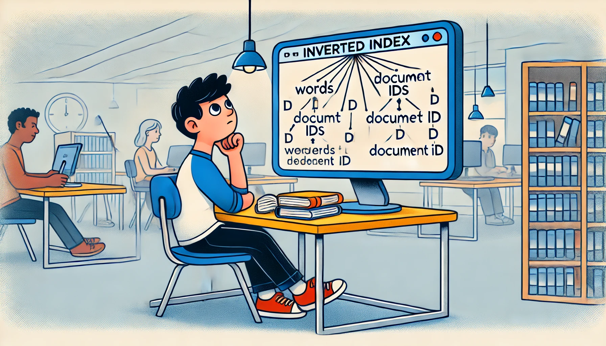

# Data Bases and Information Systems - Exercise Sheet 1  
Prof. Dr. Joschka Bödecker, Julien Brosseit, Daniel Jost

Exercise developed by **Prof. Dr. Hannah Bast and Team** with slight modifications  
Submit until **Wednesday, 30 October 2024**

## Exercise 1

Extend `inverted_index.py` by the following functionality:

1. In `build_from_file`, make sure that each inverted list contains a particular record ID at most once, even if the respective word occurs multiple times in the same record. Ensure to store the title and description of each record in a separate list. The whole construction algorithm should still run in time linear to the number of words in the input.

2. Write a function `intersect` that computes the intersection of two inverted lists. The function must run in time linear to the total number of elements in the two lists, and you must not use a library function. In particular, do not implement the lists as sets.

3. Write a function `process_query` that, given a keyword query, fetches the inverted lists for each of the keywords and computes their intersection (which will be empty if there is no inverted list for a keyword), using your `intersect` function.

4. Write a `main` function that constructs an inverted index from a given text file (with one record per line, file name given as the first argument on the command line) and then, in an infinite loop, asks the user for keyword queries and outputs the title and description of up to **three** matching records. If there are more than three matching records, output those that come first in the text file. The order in the output should correspond to the order in the text file.

Optionally, highlight the query words in the output using ANSI escape codes.

## Exercise 2

Try your code on the file `movies.tsv`. Find a query that gives good results (the records shown meet your expectations) and one that does not. Write them in your `experiences.md`, and concisely explain why one works and the other doesn’t in one or two sentences.

## Lecture Feedback

Describe your experience with the last lecture in 1-2 sentences in the file experiences.md. Your feedback helps us improve the lecture.
