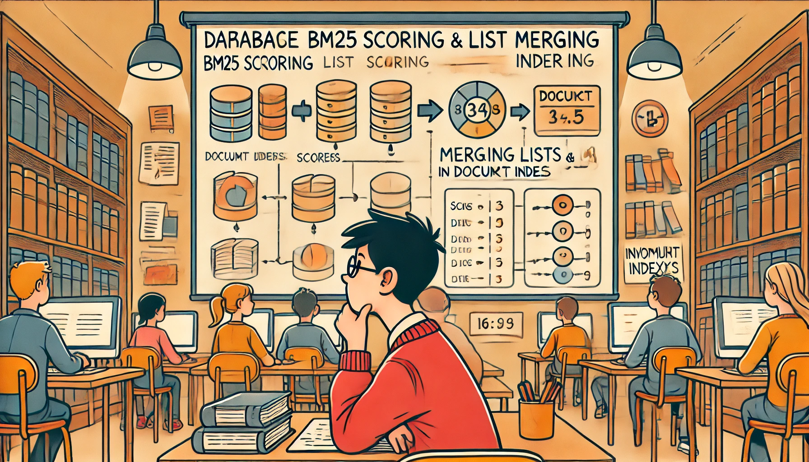

# Data Bases and Information Systems - Exercise Sheet 2  
Prof. Dr. Joschka Bödecker, Julien Brosseit, Daniel Jost

Exercise developed by **Prof. Dr. Hannah Bast and Team** with slight modifications  
Submit until **Wednesday, 06 November 2024**

## Exercise 1

Extend `inverted_index.py` from the code template on the Wiki to incorporate BM25 scores, as explained in the lecture and as detailed in the following. You can also continue from your code for ES1; in that case make sure to follow the structure from the code template and include the new unit tests from there.

1. In the method `build_from_file`, add BM25 scores to the inverted lists. Pay attention to the implementation advice given in the lecture, and avoid unnecessary complexity.
   
2. Implement the method `merge` for merging two lists. That is, the resulting list should contain all elements from the input lists in sorted order. Note that this can be done with a relatively minor change to the `intersect` method from the last exercise sheet. The function should still run in time linear in the total number of elements in the two lists.
   
3. In your method `process_query`, sort the results by the aggregated BM25 scores. You don’t have to implement the sorting algorithm yourself, you can use one of the built-in sorting functions. Your `main` function should still ask the user for keyword queries and output the title and description of up to **three** matching records, in the order returned by `process_query`.

## Exercise 2

Extend `evaluate.py` from the code template on the Wiki to automatically evaluate the quality of your system on a given benchmark as detailed in the following:

1. Write a function `read_benchmark` that reads each query with the associated set of relevant document ids from a file; see the code template regarding the format.
   
2. Write two functions `precision_at_k` and `average_precision` that take as arguments a list of result ids as it was returned by your inverted index for a single query, and a given set of ids of all documents relevant for the query, and compute the measures *P@k* and *AP*.
   
3. Write a function `evaluate` that evaluates a given inverted index against a given benchmark and computes the measures *MP@3*, *MP@R*, and *MAP* by aggregating *P@3*, *P@R* and *AP* for each query in the benchmark.
   
4. Write a `main` function that takes the following arguments: the path to a dataset (like `movies.tsv`, required argument), the path to a benchmark file (like `movies-benchmark.train.tsv`, required argument), and the BM25 parameters *b* and *k* (optional arguments, if not specified use the default values *b* = 0.75 and *k* = 1.75). If you want, you can allow more arguments for other parameters that influence the ranking. The function should then construct an inverted index from the dataset and evaluate the inverted index against the benchmark using the methods above.

## Exercise 3

Use the queries from `movies-benchmark.train.tsv` to improve search result quality in the following three ways. First, play around with the BM25 parameters *b* and *k*. Second, add or subtract keywords from the queries. Third, anything else to improve the ranking, for example using the three additional columns from `movies.tsv` (number of IMDb votes, IMDb rating and number of Wikimedia pages about the movie). Do not look at `movies-benchmark.test.tsv` at this point, that is, while you are still tuning your system. Write a short paragraph about your main insights from this step (successful improvements as well as unsuccessful ideas) in your `experiences.md`. Run the final version of your code on `movies-benchmark.test.tsv`. Feel free to add or subtract keywords from the queries, but you should do it only once. You should not tune your system to the test benchmark. Enter your results in a row in the table linked from the Wiki. Concerning the format, just follow the format of the rows which are already there.

## Lecture Feedback

Describe your experience with the last lecture in 1-2 sentences in the file experiences.md. Your feedback helps us improve the lecture.
