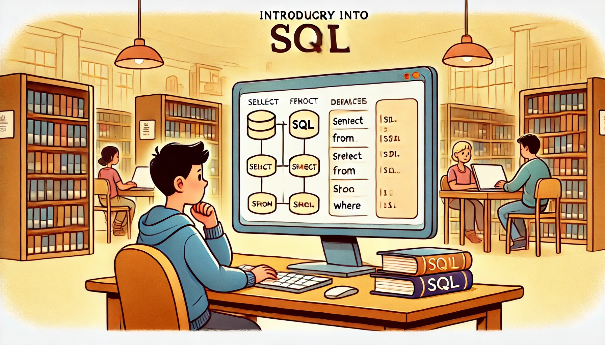

# Data Bases and Information Systems - Exercise Sheet 3 
Prof. Dr. Joschka Bödecker, Julien Brosseit, Daniel Jost

Exercise developed by **Prof. Dr. Hannah Bast and Team** with slight modifications  
Submit until **Wednesday, 20 November 2024**

## Exercise 1

For each of the movies [Fargo](https://www.imdb.com/title/tt0116282/), [Kramer vs. Kramer](https://www.imdb.com/title/tt0079417/), [Three Billboards Outside Ebbing, Missouri](https://www.imdb.com/title/tt5027774/),
and [Titanic](https://www.imdb.com/title/tt0120338/) gather the following information from IMDb (if you click on the movie titles in the
README, you get to the corresponding IMDb page), or other sources if you prefer:

1. The release year and the IMDb score.

2. The directors, producers, and at least three actors (at least one male and one female), including
the character played.

3. All Oscars (or, synonymously, Academy Awards) won in the categories: Best Actor, Best Actress, Best Supporting Actor, Best Supporting Actress, Best Director, and Best Picture, including
the information who won them.

## Exercise 2

Use the data you gathered in Exercise 1 for the following tasks:

1. Create suitable tables for your data following the principles and advice given in the lecture.
The tables and their schema used in the lecture are a good starting point. For each of your tables,
create a TSV file (with a meaningful file name) that contains the respective data. It’s up to you,
which kind of IDs you use, as long as they are used correctly.

2. Write a file `movies.sql` with SQLite3 commands for creating the tables and reading the data
from your TSV files into these tables. Pay attention to proper column names, a suitable type
(domain) for each column, and make proper use of primary and foreign keys. There is a template
for this file here in the repository, which provides some help if you want. Again, the way this was
done in the lecture is a good starting point.

If you want, write down in your `experiences.md` for each pair of tables, what is their relation (1:1,1:N, N:1, or N:M).

## Exercise 3

For each of the following questions, formulate a SQL query that returns the correct result on the
database created with your `movies.sql` from Exercise 2. Write the SQL queries in a file `queries.sql`
and before each query result print the question it answers (the template for the file provided in the repository shows how to do this).
The end result should be that one can execute `cat movies.sql
queries.sql |sqlite3` with the effect that your data is loaded into SQLite3, and the questions followed
by their respective query result are output.

1. In which year was Titanic released and what rating on IMDb does it have?
  
2. Who directed Fargo?

3. Which actors won Oscars for which roles in which movies and in which categories?

If you want, think of more questions yourself and find the SQL query that answers them (and
extend `queries.sql` correspondingly).

Commit your TSV files, `movies.sql`, and `queries.sql` to your Github repository.

## Lecture Feedback

As usual, in your `experiences.md`, provide a brief account of your experience with this sheet and
the corresponding lecture. Make sure to add a statement asking for feedback. In this statement
specify to which degree and on which parts of the sheet you want feedback. Let us know how
much time you invested and if you had any problems, and if yes, where.

Have you had any experiences with databases before?
