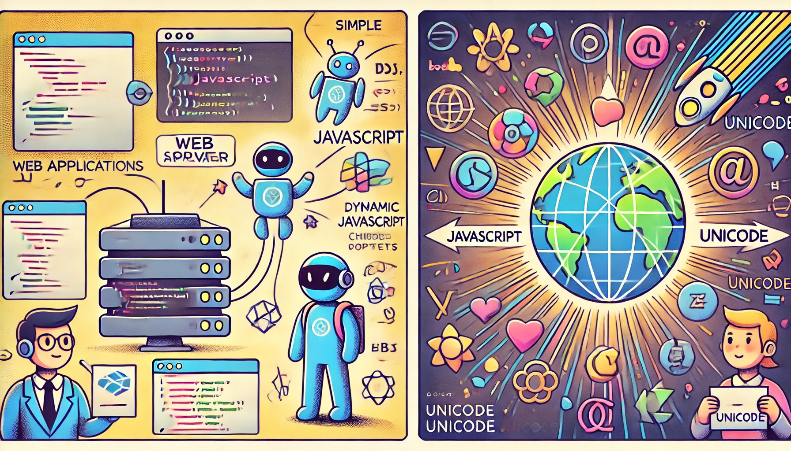

# Data Bases and Information Systems - Exercise Sheet 9
Prof. Dr. Joschka Bödecker, Julien Brosseit, Daniel Jost

Exercise developed by **Prof. Dr. Hannah Bast and Team** with slight modifications  
Submit until **Wednesday, 22 January 2025**

This exercise sheet is about making the static web application from the last sheet dynamic, dealing
properly with encoding and security issues and adding the functionality to display relations from
a knowledge graph. You can use your own solution from the last sheet or the template provided here as a starting point.

## Exercise 1
Extend your web application from exercise sheet 8 by the following components and functionality.

1. Extend your server code such that it can also serve JavaScript code and JSON objects properly
and such that for a GET request of the form `/api/search?q=<query>`, the matches for <query>
are now returned as a valid JSON object. You should not use built-in functions to produce the
JSON objects (it is easy enough to do this yourself).
2. Extend your server code such that for a GET request of the form `/api/relations?id=<id>`,
all relations where the entity with the given Wikidata ID is the subject are returned as a valid
JSON object. Again, you should not use built-in functions to produce the JSON objects. The
relations should be returned with their human readable labels, not with IDs, and should be sorted
in descending order by predicate count. For that, we provide new triples in `wikidata-properties.tsv` in [ILIAS](https://ilias.uni-freiburg.de/goto.php?target=fold_3739055&client_id=unifreiburg) which you should add to your database built from `wikidata-complex.tsv` for exercise
sheet 6.
3. Make your web application dynamic using JavaScript, as explained in the lecture. The URL
of the web page should be `http://<host>:<port>/search.html`, just like for exercise sheet 8. The
matches should now be displayed automatically after each keystroke (so that an explicit search
button is no longer necessary). As for exercise sheet 8, you should display up to 5 matches and
you should display them in a nice way, using the additional info from the input file as you see
fit. For each match, also add a button that, when pressed, displays the relations for the matched
entity directly below the match itself. You should obtain the results for matches and relations via
your APIs from item 1 and 2. When getting the results from your server, use a relative path and
do not hard-code the hostname or port of your web app anywhere.
4. Make sure that your web app deals properly with all characters in the query. The code skeleton
on the Wiki provides a number of test cases, which must work. This requires that you properly
decode what you receive from the server and that you properly encode what you send to the server.
You can use a built-in function for URL decoding or you can do the URL decoding yourself. If
you want to do the latter, you can use `bytes.fromhex` to translate a hex code to the corresponding
byte. As for exercise sheet 8, you can use Python’s built-in functions decode and encode to convert
between strings and bytes.
5. Try out the following queries: "the mätrix", "gorila", "harlem sheak", "Mikrösoft Windos",
"snow", and "asteroids". Briefly summarize your emotional reaction in your `experiences.md`.
Then, add and implement an option `--party-pooper` to protect your web app against code injection.
6. Make your web page look reasonably nice. If you already had a nice web page for exercise sheet
8, you do not have to do anything here.

As usual, in your `experiences.md`, provide a brief account of your experience with this sheet and
the corresponding lecture. Make sure to add a statement asking for feedback. In this statement
specify to which degree and on which parts of the sheet you want feedback. In addition, say how
much time you invested and if you had major problems, and if yes, where.
